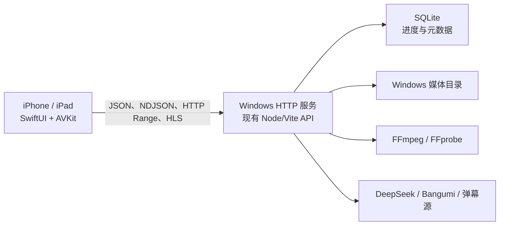

# Local Web Player iOS 客户端设计与分阶段验收方案

## 1. 文档目标

本文用于指导在 Mac 上开发 Local Web Player 的原生 iOS/iPadOS 客户端，并作为每个阶段的验收清单。

本文基于以下已经确定的前提：

- 不上架 App Store，只安装到自己的设备。
- Windows 是唯一的数据与媒体服务端。
- iPhone/iPad 只通过家庭局域网访问 Windows。
- iOS 端不下载、不导入、不持久化任何影片资源。
- 播放进度、收藏、标签、评分、评论、统计等业务数据全部写回 Windows。
- 不建设账号、配对、令牌、HTTPS 或多用户权限体系。
- 第一目标是稳定、符合 iOS 使用习惯的播放体验，不追求一次性复制 Web 端全部功能。

## 2. 最终形态与边界



### 2.1 iOS 客户端负责

- 保存 Windows 服务地址和少量纯 UI 设置。
- 加载媒体库、启动数据、缩略图和业务状态。
- 提供首页、媒体库、搜索、播放队列和设置界面。
- 使用 `AVPlayer` 播放 Windows 返回的媒体 URL。
- 渲染外挂字幕、弹幕和播放器交互层。
- 将进度、收藏、评分、评论、标签等更新写回 Windows。
- 提供画中画、AirPlay、锁屏媒体控制和横竖屏体验。

### 2.2 Windows 服务负责

- 扫描所有媒体目录并生成稳定的全局 `videoId`。
- 读取和写入 SQLite。
- 提供媒体、缩略图、字幕和封面资源。
- 使用 FFmpeg/FFprobe 检测兼容性、提取字幕、remux 或转码。
- 代理 DeepSeek、Bangumi、Bilibili、Bahamut 等外部服务。
- 对 iOS 不兼容的媒体提供兼容 MP4 或 HLS 播放出口。

### 2.3 明确不做

- iOS 本地媒体目录扫描。
- Files/iCloud 导入。
- 离线下载和离线播放。
- SwiftData/Core Data 媒体数据库。
- 把 React 页面嵌入 WKWebView。
- 在 iOS 中保存 DeepSeek 或 Bangumi 密钥。
- 在第一版迁移看图、千图成像、视频编辑、LADA 修复和高能集锦生成。

## 3. 技术选型

### 3.1 工程基础

- Xcode：Mac 可安装的最新稳定版本。
- 语言：Swift，开启严格并发检查；若首次开发受阻，可暂用 Swift 5 language mode，但代码按 Swift Concurrency 约束编写。
- UI：SwiftUI。
- 最低系统：iOS 17 / iPadOS 17。
- 播放：AVFoundation + AVKit。
- 网络：`URLSession`、`async/await`、`AsyncBytes`。
- 状态：Observation 的 `@Observable`，页面状态更新限定在 `@MainActor`。
- 测试：XCTest。
- 第三方依赖：第一版不引入。

选择 iOS 17 的原因是可以稳定使用 Observation、现代 SwiftUI 导航和并发模型，同时减少兼容分支。由于只在个人设备安装，无需为了旧系统扩大维护范围。

### 3.2 本地存储策略

iOS 只允许持久化：

- `serverBaseURL`，例如 `http://192.168.1.20:3001`。
- 纯客户端界面偏好，例如是否自动横屏、控制层自动隐藏时间。
- 最后一次连接是否成功等非媒体诊断信息。

禁止持久化：

- 视频文件或视频片段。
- HLS 离线包。
- 媒体库完整镜像。
- 播放进度、收藏、标签等权威业务数据。
- 缩略图、海报、字幕的主动磁盘缓存。

API 和图片请求使用 `URLSessionConfiguration.ephemeral`；自建 `URLCache` 的磁盘容量设为 `0`。AVPlayer 为连续播放产生的系统临时缓冲不可完全消除，但客户端不得调用 `AVAssetDownloadURLSession`，也不得主动把媒体响应写入文件。

## 4. 推荐工程结构

```text
LocalWebPlayerIOS/
├── App/
│   ├── LocalWebPlayerApp.swift
│   ├── AppEnvironment.swift
│   └── RootView.swift
├── Core/
│   ├── Networking/
│   │   ├── APIClient.swift
│   │   ├── APIError.swift
│   │   ├── Endpoint.swift
│   │   ├── RelativeURLResolver.swift
│   │   └── NDJSONStreamDecoder.swift
│   ├── Models/
│   │   ├── Video.swift
│   │   ├── Subtitle.swift
│   │   ├── PlayerData.swift
│   │   ├── MediaRoot.swift
│   │   └── ServerBootstrap.swift
│   ├── Persistence/
│   │   └── ClientSettings.swift
│   └── UI/
│       ├── AsyncRemoteImage.swift
│       ├── LoadingStateView.swift
│       └── ErrorStateView.swift
├── Features/
│   ├── Connection/
│   ├── Home/
│   ├── Library/
│   ├── Search/
│   ├── Player/
│   │   ├── PlayerStore.swift
│   │   ├── PlayerContainerController.swift
│   │   ├── PlayerContainerView.swift
│   │   ├── PlayerControlsView.swift
│   │   ├── PlaybackProgressWriter.swift
│   │   ├── PlaybackQueue.swift
│   │   └── NowPlayingCoordinator.swift
│   ├── Subtitles/
│   │   ├── SubtitleEngine.swift
│   │   ├── SRTParser.swift
│   │   └── VTTParser.swift
│   ├── Danmaku/
│   └── Settings/
└── Tests/
    ├── Fixtures/
    ├── NetworkingTests/
    ├── ModelTests/
    ├── SubtitleTests/
    └── PlayerTests/
```

不建立一个包含所有页面和播放器状态的巨大 `AppStore`。连接、媒体库和播放器分别管理自己的生命周期，通过 `AppEnvironment` 注入共享 `APIClient`。

## 5. 原生界面信息架构

### 5.1 iPhone

根视图使用 `TabView`：

1. 首页：继续观看、收藏/稍后看、最近观看。
2. 媒体库：按当前媒体模式浏览全部条目。
3. 搜索：搜索当前媒体模式内的全局媒体库。
4. 设置：服务器地址、连接诊断、播放器偏好。

播放页面使用全屏呈现，不把桌面双栏播放器压缩到手机屏幕。竖屏时视频位于顶部、队列位于下方；横屏时进入沉浸式播放器，控制层在用户操作后临时覆盖视频。

### 5.2 iPad

媒体库优先使用 `NavigationSplitView`：左侧筛选/媒体根，中间列表，右侧详情或播放器。播放器进入全屏时仍使用统一的播放器容器，不维护第二套播放实例。

### 5.3 视觉原则

- 使用 `NavigationStack`、`TabView`、`List`、`Toolbar`、系统菜单等原生模式。
- 使用 `Color(.systemBackground)`、`Color.secondary`、`Color(.separator)` 等语义颜色。
- 图标使用 SF Symbols 名称，不从 Web 端复制 Lucide SVG。
- 不逐像素翻译现有 CSS；保留信息层级和业务行为，重新适配触控、Safe Area 和 Dynamic Type。
- 所有主要触控目标至少 44×44pt。
- 深浅色跟随系统，第一版不实现独立主题系统。

## 6. 数据模型与接口约定

### 6.1 身份规则

- `video.id` 是唯一业务标识，必须原样使用。
- 不使用文件名、标签或 `relativePath` 作为唯一标识。
- 所有进度、收藏、评分、评论、标签、字幕选择都用 `video.id` 关联。
- `mediaRootId` 用于定位 Windows 媒体根和播放接口。
- 时间戳保持服务端现有的 Unix 毫秒格式。

### 6.2 URL 规则

- 设置页保存的 Base URL 不以 `/` 结尾。
- 服务返回的相对 URL 统一通过 `RelativeURLResolver` 基于 Base URL 转为绝对 URL。
- 不手工拼接媒体文件系统路径。
- 路径参数使用 `URLComponents` 或逐段 percent-encoding，避免中文、空格、`#`、`%` 和斜杠被重复编码。
- iOS 优先消费扫描结果中已有的 `video.url`、`posterUrl`、`fanartUrl`、`thumbUrl`，不自行推断资源 URL。

### 6.3 第一版直接复用的接口

| 用途 | 接口 | 阶段 |
|---|---|---|
| 连接检查与启动偏好 | `GET /api/bootstrap` | 1 |
| 服务能力与媒体根 | `GET /api/local-config` | 1 |
| 媒体扫描缓存 | `GET /api/media-roots/scan-cache` | 2 |
| 主启动业务数据 | `GET /api/player-data/global?view=startup` | 2 |
| 延迟业务数据 | `GET /api/player-data/global?view=deferred` | 8 |
| 媒体播放 | `GET /api/media/{rootId}/{relativePath}` | 3 |
| 兼容媒体播放 | `GET /api/media-compatible/{hash}.mp4` | 4 |
| 兼容性检测 | `POST /api/media/probe` | 4 |
| 发起 remux | `POST /api/media/compatible/remux` | 4 |
| 处理任务状态 | `GET /api/media/processing-task` | 4 |
| 保存/删除进度 | `PUT/DELETE /api/player-data/progress/{videoId}` | 3 |
| 收藏 | `PUT/DELETE /api/player-data/favorites/{videoId}` | 5 |
| 标签 | `PUT /api/player-data/tags/{videoId}` | 8 |
| 评分 | `PUT/DELETE /api/player-data/ratings/{videoId}` | 8 |
| 评论 | `PUT/DELETE /api/player-data/comments/{videoId}` | 8 |
| 弹幕获取 | `POST /api/danmaku/fetch` | 8 |
| 弹幕内容 | `POST /api/danmaku/source` | 8 |
| AI 字幕能力 | `/api/ai/subtitles/*` | 8 |

接口错误统一解码服务端的 `{ "error": "..." }`。非 2xx 响应不得直接显示系统英文错误，需映射为连接失败、资源不存在、格式不兼容、服务器处理中等用户可理解状态。

### 6.4 建议新增的 iOS 播放决策接口

为避免 iOS 复制 Web 端复杂的兼容性判断，建议在阶段 4 新增一个聚合接口：

```text
POST /api/ios/playback-source
```

请求：

```json
{
  "videoId": "全局视频 ID",
  "mediaRootId": "媒体根 ID",
  "relativePath": "相对路径"
}
```

返回状态之一：

```json
{
  "mode": "direct",
  "url": "/api/media/..."
}
```

```json
{
  "mode": "compatible",
  "url": "/api/media-compatible/....mp4"
}
```

```json
{
  "mode": "processing",
  "taskId": "...",
  "progress": 0,
  "message": "正在准备兼容版本"
}
```

```json
{
  "mode": "unsupported",
  "reason": "当前格式需要转码，但服务端未启用 HLS 转码"
}
```

第一版不必立刻支持 HLS。先覆盖可直接播放和可无损 remux 的文件，再根据实际媒体格式样本决定是否增加按需 HLS。

## 7. 播放器设计

### 7.1 播放容器

使用 `AVPlayerViewController` 的 UIKit 包装层，而不是只使用 SwiftUI `VideoPlayer`。原因：

- 更容易管理画中画、AirPlay、全屏和系统播放状态。
- 可以通过统一容器挂载自定义字幕和控制层。
- 可以避免播放器视图重建时意外创建第二个 `AVPlayer`。

`PlayerStore` 持有唯一 `AVPlayer`，页面切换只改变呈现方式，不更换播放对象。

### 7.2 状态机

```text
idle
  → resolvingSource
  → preparing
  → readyPaused / playing
  → buffering
  → ended
  → failed

resolvingSource
  → processingCompatibleMedia
  → preparing
```

界面必须根据状态机显示明确内容，不能把黑屏同时用于加载、缓冲和失败。

### 7.3 时间与进度

- UI 时间轴使用 AVPlayer 周期观察者更新，推荐 0.25 秒一次。
- 播放进度每 10 秒节流写回一次。
- 暂停、切换影片、进入后台、播放结束和播放器销毁前立即写回。
- 小于 5 秒且没有有效播放行为的记录不写入。
- 完成阈值与 Web 端保持一致，不由 iOS 另定义一套语义。
- 从服务端恢复时，实际 seek 到 `min(currentTime, duration)`；恢复误差目标不超过 2 秒。

### 7.4 网络中断

- 短时缓冲由 AVPlayer 自己处理。
- 连接失败时保留当前 `videoId`、播放位置和队列，不自动跳下一集。
- 提供“重试当前影片”和“返回媒体库”。
- Windows 服务恢复后，重试应重新解析播放 URL，并 seek 回失败前位置。
- 不将网络失败错误误写为已看完或清除进度。

### 7.5 格式策略

| 文件情况 | iOS 行为 |
|---|---|
| AVPlayer 可直接播放 | 直接使用原媒体 Range URL |
| 容器不兼容但音视频流可 remux | Windows 生成兼容 MP4，完成后播放 |
| 需要转码 | 第一版显示明确不支持；阶段 4 后可增加 HLS |
| 服务端找不到文件 | 显示资源已移动/删除，不自动改写媒体库 |
| 媒体仍在处理 | 显示进度、允许取消或离开页面 |

## 8. 字幕设计

### 8.1 第一版

- 支持外部 SRT 和 WebVTT。
- 字幕文本通过 Windows URL 获取，不保存到磁盘。
- `SRTParser`、`VTTParser` 输出统一的 `SubtitleCue(start, end, text)`。
- `SubtitleEngine` 使用排序数组和二分查找定位当前 cue。
- seek 后立即重新计算当前 cue，不依赖顺序递增状态。
- 字幕覆盖层位于视频内容区域内，不覆盖播放器常驻控制。

### 8.2 后续

- 使用现有内封字幕探测与提取接口。
- 优先播放文本字幕；PGS/VobSub 第一版只提示不支持。
- `-translated.srt/vtt` 在开始播放时向服务端即时确认，不只依赖旧扫描缓存。
- 字体使用系统字体，支持字号、粗细和背景透明度，不复制 Web `::cue` CSS。

## 9. 弹幕设计

弹幕属于第二批功能。大量弹幕不使用纯 SwiftUI View 逐条做每帧布局，推荐 UIKit `UIView` + `CADisplayLink` + 可复用文本层：

- 数据解析、过滤和轨道分配放在独立 actor。
- 渲染层只接收当前时间窗口内需要展示的条目。
- seek、切集、暂停和后台时清空或重建活动轨道。
- 支持滚动、顶部、底部三种模式。
- 显示简体、透明度、速度、密度、显示区域和字号沿用服务端偏好。
- 字幕层始终高于弹幕层，控制层始终高于两者。

## 10. 分阶段开发与验收

每一阶段必须在真实 iPhone 上验收。模拟器可用于布局和单元测试，但不能代替真实设备上的局域网、解码、横屏、画中画、发热和电量验证。

### 阶段 0：环境与链路打通

目标：证明 Mac、iPhone 和 Windows 三端可以形成最小闭环。

任务：

- 在 Mac 创建 SwiftUI App，部署目标 iOS 17。
- 配置个人开发团队和 Bundle ID。
- iPhone 开启 Developer Mode，与 Xcode 配对。
- 增加 `NSLocalNetworkUsageDescription`。
- 配置仅允许本地网络 HTTP 的 ATS 例外。
- Windows 服务监听局域网地址，而不再只监听 `127.0.0.1`。
- 设置 Windows 固定局域网 IP，或至少记录当前 IP。
- iPhone 请求 `GET /api/bootstrap`。

验收：

- [ ] Xcode 能将空壳 App 安装到真实 iPhone。
- [ ] iPhone 首次连接时出现本地网络权限提示。
- [ ] 同意后能显示 `/api/bootstrap` 的主题或媒体库元数据。
- [ ] Windows 服务关闭时显示应用内连接失败，不崩溃。
- [ ] Windows 服务重启后点击重试即可恢复。

阶段出口：真机能稳定访问 Windows API，才能进入下一阶段。

### 阶段 1：工程骨架与连接设置

目标：形成可长期扩展的客户端基础，不急于制作播放器界面。

任务：

- 实现 `ClientSettings` 保存 Base URL。
- 实现 `APIClient`、统一错误和相对 URL 解析。
- 实现连接设置页、连接中、成功、失败四种状态。
- 实现 `GET /api/bootstrap` 与 `GET /api/local-config` DTO。
- 使用 ephemeral URLSession，磁盘缓存为 0。
- 为 JSON 解码、HTTP 状态和超时写最小单元测试。

验收：

- [ ] 支持输入 `http://IP:端口`，自动去除尾部斜杠。
- [ ] 中文媒体根名称正确解码。
- [ ] 错误地址、超时、拒绝连接、非 JSON 响应分别有明确错误。
- [ ] 切换服务器地址后不残留上一个服务的页面数据。
- [ ] 重启 App 后只恢复服务器地址，不恢复媒体资源缓存。

### 阶段 2：媒体库读取与浏览

目标：在真实媒体库上流畅浏览，不播放视频。

任务：

- 加载 `/api/media-roots/scan-cache`。
- 并行加载 `/api/player-data/global?view=startup`。
- 解码 `Video`、`Subtitle`、`PlaybackProgress`、收藏和标签模型。
- 建立 `videoId -> 业务状态` 索引。
- 首页展示继续观看、收藏和最近观看。
- 媒体库使用 Lazy 容器，缩略图仅在可见时请求。
- 搜索限定在当前媒体模式内，第一版可在内存中搜索已加载视频。

验收：

- [ ] 实际媒体库的视频总数和 Windows Web 端一致。
- [ ] 同相对路径但不同媒体根的视频不会合并。
- [ ] 继续观看标题使用文件名去扩展名。
- [ ] 收藏、进度和标签能正确对应到 `video.id`。
- [ ] 快速滚动媒体列表时无明显持续卡顿和图片错位。
- [ ] 缩略图失败只影响对应卡片，可单独重试。
- [ ] 搜索模式边界与 Web 端一致：追番只搜 Anime，特殊模式只搜特殊库。

性能验收建议：在真实媒体库上记录冷启动、JSON 解码耗时和峰值内存；如扫描缓存过大导致首屏超过 5 秒，再设计服务端分页接口，不要先行过度设计。

### 阶段 3：直接播放与进度闭环

目标：完成第一个真正可日常使用的播放器版本。

任务：

- 实现 AVPlayer 容器和播放状态机。
- 使用媒体扫描结果的 `video.url` 建立播放项。
- 实现播放/暂停、拖动、前进后退、音量、播放速度。
- 实现缓冲、失败、结束状态。
- 恢复 Windows 进度并按规则写回。
- 实现顺序播放、单集循环、列表循环和随机播放队列。
- 切集时销毁旧时间观察者，避免重复回调。

验收：

- [ ] 至少选择 3 个已知可直接播放的 MP4/MOV 真机播放。
- [ ] 播放开始、暂停、拖动和结束不会出现两个声音或重复播放器。
- [ ] 拖动到开头、中间、接近结尾均能继续播放。
- [ ] 离开播放页再进入，恢复误差不超过 2 秒。
- [ ] Windows Web 端能看到 iOS 写回的进度。
- [ ] Web 端修改进度后，iOS 重新加载可获取新值。
- [ ] 网络断开不会把视频标为完成。
- [ ] 连续切换 20 个视频后没有持续增长的播放器实例或时间观察者。

MVP 里程碑：完成阶段 3 后，项目已经具备“浏览—播放—同步进度”的基本使用价值。

### 阶段 4：格式兼容与服务端播放决策

目标：覆盖实际媒体库中的 MKV 和其他常见格式，避免用户面对 AVPlayer 的无信息失败。

任务：

- 接入 `/api/media/probe`、兼容 MP4 和处理任务接口。
- 优先实现聚合的 `/api/ios/playback-source`。
- iOS 展示正在检测、正在准备兼容版本、完成和失败。
- 允许离开处理页，回到同一视频时继续读取任务状态。
- 收集实际媒体库格式样本，决定是否增加 HLS 转码。

验收格式矩阵至少包含：

- [ ] MP4 + H.264 + AAC：直接播放。
- [ ] MP4 + HEVC + AAC：在目标 iPhone 上直接播放或给出明确原因。
- [ ] MKV + H.264 + AAC：remux 后播放。
- [ ] MKV + H.264 + DTS：明确提示需要转码，或通过 HLS 播放。
- [ ] 10-bit HEVC 样本：根据目标设备实测记录结果。
- [ ] 损坏文件：显示可理解错误，不无限缓冲。
- [ ] Windows 缺少 FFmpeg：入口在检测后立即提示，不进入假处理状态。

阶段出口：对每个失败样本都能解释原因；不允许只显示黑屏或永久菊花。

### 阶段 5：字幕

目标：外挂中文字幕达到可日常观看水平。

任务：

- 实现 SRT/VTT 解析和统一 cue 模型。
- 实现字幕选择、关闭和样式设置。
- 播放开始时确认同目录 `-translated` 字幕。
- seek、倍速、暂停和切集时同步字幕。
- 第二步接入内封文本字幕探测与提取。

验收：

- [ ] UTF-8 中文、英文、日文 SRT 正确显示。
- [ ] WebVTT 正确处理时间戳和多行文本。
- [ ] 快速连续 seek 后字幕不会停留在旧 cue。
- [ ] 0.5×、1×、2× 播放速度下字幕跟随媒体时间。
- [ ] 新生成的 `-translated.srt/vtt` 无需重扫整个库即可发现。
- [ ] 横竖屏、安全区和底部控制条不会裁切字幕。
- [ ] PGS/VobSub 不支持时显示明确说明。

### 阶段 6：首页、搜索和队列体验完善

目标：把“能播放”提升为适合手机长期使用的产品体验。

任务：

- 完善首页继续观看、收藏/稍后看和最近观看。
- 搜索结果展示缩略图、标题、路径、标签、评价和评分。
- 实现播放队列、上一集、下一集和自动连播提示。
- iPhone 竖屏采用单列，横屏播放器沉浸显示。
- iPad 使用自适应 Split View。
- 支持 Dynamic Type、VoiceOver 标签和 Reduce Motion。

验收：

- [ ] 单手可以完成搜索、选择、播放、暂停和切下一集。
- [ ] 所有主要按钮触控面积至少 44×44pt。
- [ ] 长文件名、中文路径和大量标签不会横向溢出。
- [ ] iPhone SE 尺寸、普通 iPhone、Pro Max 和 iPad 布局均可用。
- [ ] 横竖屏切换不重建 AVPlayer、不丢失时间和队列。
- [ ] 最近观看最多 10 条，不显示无意义的“查看全部”。
- [ ] 搜索严格遵守当前媒体模式范围。

### 阶段 7：画中画、AirPlay 与系统媒体体验

目标：接入 iOS 原生媒体能力。

任务：

- 配置 `AVAudioSession` 为 `.playback` + `.moviePlayback`。
- 开启 Audio、AirPlay、Picture in Picture Background Mode。
- 使用 AVPlayerViewController 画中画能力。
- 接入 Now Playing 信息和远程播放命令。
- 处理电话、耳机拔出、系统音频中断。

验收：

- [ ] 用户主动进入画中画后视频继续播放。
- [ ] 从画中画返回 App 能恢复正确播放器页面。
- [ ] 锁屏显示标题、播放/暂停和进度。
- [ ] 耳机拔出后按系统预期暂停。
- [ ] 电话或其他音频中断结束后状态合理，不自动双重播放。
- [ ] AirPlay 目标可用时系统路由按钮正常工作。

### 阶段 8：弹幕、标签与 AI 等扩展功能

目标：按使用频率逐个迁移 Web 端高价值功能。

建议顺序：

1. 收藏、标签、评分、评论编辑。
2. 弹幕源选择和弹幕渲染。
3. 演员信息和标签筛选。
4. 无剧透回顾、字幕摘要和问答。
5. 观看统计和活动日历。
6. 重复视频检测结果查看。

验收：

- [ ] 所有写操作以 `videoId` 为身份，不以标签或文件名关联。
- [ ] iOS 和 Web 对同一视频的收藏、标签、评分和评论最终一致。
- [ ] 弹幕密集样本下控制条仍可响应，字幕不被弹幕遮挡。
- [ ] seek 后旧弹幕立即清理，新时间点弹幕重新调度。
- [ ] AI 流式内容可逐段显示、取消并正确呈现服务端错误。
- [ ] DeepSeek 密钥始终只存在 Windows 环境。
- [ ] 无有效 `matchIds` 时不展示模型对任意候选的自由解释。

### 阶段 9：稳定性与日常使用验收

目标：从开发版本转为可每天使用的个人版本。

需要完成的场景：

- App 冷启动、热启动、后台恢复。
- Windows 服务启动较慢、重启和临时离线。
- Wi-Fi 弱信号、路由器切换、手机锁屏再解锁。
- 连续播放、随机播放、长视频、多次 seek。
- 竖屏、横屏、画中画和 AirPlay 状态切换。
- 大媒体库、长中文文件名、缺失缩略图、文件已删除。
- MP4、MOV、MKV、H.264、HEVC、AAC、DTS 和字幕样本矩阵。

最终验收：

- [ ] 连续播放 2 小时无崩溃、无音画实例重复。
- [ ] 连续切换 50 个视频后内存能回落到合理区间。
- [ ] 进度不会因网络错误、播放器失败或快速切集被错误覆盖。
- [ ] App 不包含影片下载入口，沙箱中没有主动持久化的视频或 HLS 文件。
- [ ] Windows 是所有业务数据的唯一权威来源。
- [ ] 主要错误均有应用内说明和恢复操作。
- [ ] 真机实际观看体验达到可接受水平后才迁移低频高级功能。

## 11. 测试策略

### 11.1 单元测试

优先覆盖纯逻辑：

- 相对 URL 解析与中文路径编码。
- 扫描缓存和启动数据 JSON 解码。
- `videoId` 身份映射。
- 播放队列和各种播放模式。
- 进度节流、完成状态和写回时机。
- SRT/VTT 解析和 cue 二分查找。
- NDJSON 流式解析。

### 11.2 集成测试

使用当前 Windows 实际服务，不另造模拟后端作为最终验收依据：

- 启动数据与 Web 端一致。
- HTTP Range 播放和 seek。
- 进度双向同步。
- FFmpeg 兼容处理。
- 字幕和弹幕接口。
- 服务重启后的恢复。

### 11.3 测试夹具

在 `Tests/Fixtures` 保存去隐私化 JSON 和小型字幕文本，不提交真实媒体路径、API 密钥或影片文件。媒体播放测试直接使用个人局域网资源。

## 12. 第一轮 Mac 开发执行清单

建议第一次拿到 Mac 后严格按以下顺序执行：

1. 安装最新稳定 Xcode。
2. 创建 `LocalWebPlayerIOS` SwiftUI App，最低 iOS 17。
3. 配置 Signing Team 和唯一 Bundle ID。
4. 在 iPhone 开启 Developer Mode，并完成有线或无线配对。
5. 配置本地网络用途说明和 ATS 本地网络例外。
6. 在 Windows 上让服务监听局域网地址。
7. 用 iPhone Safari 访问 `http://WindowsIP:3001/api/bootstrap` 做链路冒烟检查。
8. 在 App 中完成同一请求并显示结果。
9. 创建本文第 4 节的最小目录结构。
10. 完成阶段 1 后再开始媒体库页面，不提前制作复杂播放器 UI。

## 13. 阶段验收记录模板

每完成一阶段，在开发仓库记录：

```text
阶段：
验收日期：
Xcode 版本：
iOS/iPadOS 版本：
测试设备：
Windows 服务版本/提交：
iOS 客户端提交：
通过项：
未通过项：
已知限制：
关键截图或录屏：
是否允许进入下一阶段：是 / 否
```

未通过的阶段出口条件必须先解决或明确降级，不要在播放器基础链路不稳定时继续堆叠弹幕、AI 和复杂首页功能。

## 14. 实施原则总结

- 原生重建交互，不移植 React 页面结构。
- Windows 保持唯一数据源，iOS 保持轻客户端。
- 先验证真实媒体播放，再完善视觉。
- 先直接播放，再 remux，最后按实际需要决定 HLS。
- 每一阶段都在真实 iPhone 和真实 Windows 媒体库上验收。
- 任何失败都必须落入可解释状态，播放器不允许以黑屏代表未知错误。
- 功能迁移按使用价值排序，完整复刻不是第一版目标。
